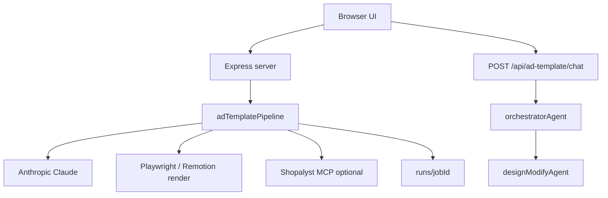

# Ad Template Studio

**What we built:** A web studio that turns a product brief into multiple ready-to-review ad designs — with live progress, written creative rationale, and a chat assistant you can use to refine the results.

**Where to use it:** Open http://localhost:8787 after running `npm run ui` (see [Setup](#setup) at the end for installers).

---

## The big idea

Marketing teams often need several ad options fast: different layouts, headlines, and moods for the same product. Usually that means briefing a designer, waiting on rounds of feedback, and still only seeing a handful of directions.

**Ad Template Studio** shortens that loop. You describe the product once — photo, name, prices, audience, optional logo — and the system produces **multiple ad concepts** in the size you need (square feed, story, portrait, landscape). Each option is a real visual preview you can download, tweak, or ask to change in plain language.

Think of it as a small creative team working in sequence:

1. **Research** — What works for this product and category?
2. **Plan** — What distinct creative directions should we try?
3. **Build** — Lay out each ad with your real product image and copy.
4. **Deliver** — Show the strongest options and let you refine.

You stay in control: the ads use **your** product image and **your** text. The system does not invent fake reviews, prices, or claims unless you explicitly ask for broader creative direction in the brief.

---

## What you see on the home page

The screen is split into three areas. You can use them in order, or jump to chat anytime.

```
┌──────────────────┬─────────────────────────────┬──────────────────┐
│  Your product      │  Reports & finished ads     │  Chat with the   │
│  brief + progress  │                             │  Orchestrator    │
└──────────────────┴─────────────────────────────┴──────────────────┘
```

| Area | In plain terms |
|------|----------------|
| **Left — Product brief** | Where you enter product details and click **Generate ad templates**. While work runs, you see which stage is active and a simple activity log. |
| **Center — Workspace** | Written summaries from the research and strategy steps, then a grid of **design previews** when ready. |
| **Right — Orchestrator** | A chat assistant that coordinates everything. Ask questions, request changes, or resume if something stopped. |

A status line at the top confirms the app is ready (API connected, renderer available).

---

## Step by step: how you use it

### 1. Fill in the product brief

**You must provide:**

- A **product image** (upload or paste a public image link)
- A **product title**

**Everything else is optional but helps quality:**

| You can add… | Why it helps |
|--------------|--------------|
| Tagline, captions, hashtags | Gives the ads real copy to work with |
| Sale price, offer price, discount | For promo-style layouts |
| Star rating | Shown when the layout includes a rating element |
| Logo | Brand mark on the ad |
| Reference ad (image) | “Make it feel like this” — style inspiration, not a copy |
| Category, language, audience, merchant info | Sharper research and messaging |
| Marketplace product page link | Extra context from the listing page |
| Custom design direction | Only place to ask for creative ideas beyond your form fields |
| Aspect ratio | Match where you will publish (Instagram square, Story, etc.) |
| How many concepts to generate / how many to show | More ideas internally; you still pick how many appear (e.g. top 4) |

**Optional checkbox — Remove background:** Cuts out the product (and logo) from its background so it sits cleanly on the ad. Requires an internal image service when using uploaded files.

When you are ready, click **Generate ad templates**.

### 2. Watch progress

The left panel shows three familiar stages:

1. **Product Analyst** — Studies your product, audience, and what tends to work in similar ads.
2. **Design Strategist** — Plans several different creative approaches (layout, mood, message).
3. **Renderer** — Turns each plan into an actual preview image.

Messages stream in the log (“Rendering candidate 2 of 6…”, etc.). You do not need to refresh the page.

### 3. Read the reports

In the center, two reports appear as work completes:

- **Product Analyst** — Who this product is for, what competitors do, visual trends, message angles.
- **Design Strategist** — Why these creative directions were chosen and how they differ.

The same summaries appear in chat so you can refer back later.

### 4. Review design previews

When finished, you see your best options labeled **design_1**, **design_2**, and so on (how many depends on your “Show top” setting).

For each design you can:

- **View** the ad preview
- **Download PNG** for sharing or further design work
- **Customize template** — Change headline, colors, fonts, product/logo image, background, rating, etc., with a live preview; then apply to re-render
- **View design tree** — The underlying structure (mainly for technical teammates)

### 5. Talk to the Orchestrator

The chat on the right is your single point of contact. Examples:

- “Summarize the analyst report.”
- “Why is design_2 so minimal?”
- “Make design_1’s headline red and change the button to Shop Now.”
- “Continue” — if the pipeline stopped midway

Use the design labels (**design_1**, **design_2**, …) when asking for edits.

If something fails, a **Resume pipeline** button appears under the form, or you can ask the Orchestrator to continue.

---

## What you get out of it

| Outcome | Description |
|---------|-------------|
| **Several ad directions** | Not one guess — multiple layouts and moods to compare |
| **Transparency** | Written rationale for research and creative choices |
| **Your assets, your words** | Real product photo and brief copy on the canvas |
| **Fast iteration** | Visual editor for small tweaks; chat for larger changes |
| **Saved work** | Each run is stored on the server under a job folder for replay or resume |

**Typical canvas sizes**

| Format | Size | Good for |
|--------|------|----------|
| Square 1:1 | 1080 × 1080 | Feed posts |
| Portrait 4:5 | 1080 × 1350 | Feed portrait |
| Story 9:16 | 1080 × 1920 | Stories, Reels |
| Landscape 16:9 | 1920 × 1080 | YouTube, banners |

---

## Who this is for

| Role | How they might use it |
|------|------------------------|
| **Marketing / growth** | Generate options for a campaign, pick a direction, download PNGs |
| **Creative / design** | Use outputs as starting comps; refine in Customize template or export trees |
| **Product / category** | Test how a SKU could look in paid social without a full design cycle |
| **Engineering** | Run locally, inspect job outputs, extend pipeline (see technical section) |

---

## Good practices (everyone)

1. Use a clear product photo; turn on background removal if the shot is busy.
2. Fill in prices and tagline when the ad should show an offer.
3. Add category and audience — better research, better layouts.
4. Upload a **reference ad** if you have a style target.
5. Pick the **aspect ratio** for the channel you will use.
6. Generate more concepts internally (e.g. 6) but show the top few (e.g. 4) to keep review focused.
7. Small text/color changes → **Customize template**; layout or “make it bolder” → **chat**.

---

## Limitations to set expectations

- Quality depends on the brief: sparse input → simpler ads.
- Copy and claims come from what you provide (except **Custom design direction**).
- Background removal for **uploaded** images may need extra server configuration so external services can reach your files.
- Generation uses AI and takes a few minutes; it is not instant like a static template picker.
- Chat-based layout changes are powerful but should be specific (“design_2 headline”, “design_1 CTA color”).

---

## Setup (for anyone running the demo)

```bash
npm install
npm run setup-browser
npm run setup-remotion
```

Create `.env.local`:

```env
ANTHROPIC_API_KEY=your_key
ANTHROPIC_MODEL=claude-sonnet-4-6
```

Start:

```bash
npm run ui
```

Open **http://localhost:8787**.

---

# Technical appendix — how it works

*For teammates who want implementation detail. The sections above are enough for demos and stakeholder conversations.*

## Architecture overview

The home page (`public/index.html` + `public/ad-template.js`) talks to an Express server (`server.js`). Submitting the brief calls `POST /api/ad-template/generate`, which streams **NDJSON** progress events while `runAdTemplatePipeline()` in `src/adTemplatePipeline.js` executes. Each job writes to `runs/<jobId>/`.



## Pipeline steps (engine)

Six checkpointed steps in `PIPELINE_STEPS`:

| Step | Code / agent | What happens |
|------|----------------|--------------|
| `prep` | `adTemplatePipeline` | Copy product/logo/reference; optional `removeBackgroundToFile` via MCP; trim transparent PNG; save `brief.json`, `frame.json` |
| `analysis` | `productAnalysisAgent` | Vision + text analysis; optional `webResearch` / product page fetch → `product_analysis.json`, `analysis_summary.md` |
| `strategy` | `designStrategyAgent` | 4 concept plans from analysis + DesignSkills playbook → `design_strategy.json` |
| `design` | `designCreatorAgent` | N design trees (default 6) as JSON layers → `generated_designs.json` |
| `render` | `renderDesignCandidate` + `polishAdDesign` | Wire `assets/product.png`, layout fix/QA, browser render to `designs/<id>/preview.png`; optional vision polish loops |
| `finalize` | `scoreDesigns` + `pickTopDesigns` | Rank candidates; expose top `outputCount` as `design_1…N` in `result.json` |

State is tracked in `runs/<jobId>/pipeline_state.json` for resume via `POST /api/ad-template/jobs/:jobId/resume`.

## UI ↔ API mapping

| User action | Endpoint | Notes |
|-------------|----------|--------|
| Generate | `POST /api/ad-template/generate` | `multipart/form-data` (uploads) or JSON (URLs); streams `start`, `progress`, `done`, `error` |
| Health | `GET /api/health` | `anthropicKey`, `playwright`, `mcpUiTools`, `model` |
| Chat | `POST /api/ad-template/chat` | Body: `{ jobId, message }`; may return `modifications[]`, `pipelineAction` |
| Resume | `POST /api/ad-template/jobs/:jobId/resume` | Body: `{ fromStep, force, forceSteps }` |
| Template props | `GET …/designs/:designId/template-props` | Editable fields from `templateProps.js` |
| Apply template | `POST …/apply-template` | Overrides JSON + optional images; no LLM |
| Abort | `POST …/abort` | Sets pipeline status aborted |

## Design tree and render

- A **design tree** is JSON: canvas size, `backgroundColor`, `children[]` with typed nodes (`text`, `image`, `button`, `rating`, etc.), positions, and `src` for assets.
- **Render:** `renderToFilesBrowser()` (Playwright) produces PNG previews; Remotion bundle (`remotion/`) powers interactive grid preview when built.
- **Polish:** `polishAdDesign` compares rendered PNG to tree via vision LLM; `fixDesignTreeLayout` / `layoutQuality` enforce margins and overlap rules.

## Orchestrator actions

`orchestratorAgent` returns JSON: `reply` + optional `actions`:

- `modify_design` → `designModifyAgent` → patches tree → re-render
- `resume_pipeline` / `retry_pipeline` → `resumeAdTemplatePipeline`
- `stop_pipeline` → `abortAdTemplatePipeline`

## Key artifacts per job

```
runs/<jobId>/
  brief.json
  frame.json
  product_analysis.json
  design_strategy.json
  generated_designs.json
  design_scores.json
  result.json
  pipeline_state.json
  chat.json
  assets/product.png
  designs/<candidateId>/design_tree.json
  designs/<candidateId>/preview.png
```

## Environment

| Variable | Role |
|----------|------|
| `ANTHROPIC_API_KEY` | Required for agents |
| `ANTHROPIC_MODEL` | Default `claude-sonnet-4-6` |
| `PUBLIC_BASE_URL` | Public URL to this server — needed for MCP background removal on **file uploads** |
| `AD_GENERATE_COUNT` / `AD_OUTPUT_COUNT` | Server-side defaults for concept count |

## Content guardrails (implementation)

- Strategist/creator system prompts require brief fields only unless `customPrompt` is set.
- `ensureBriefRatingNode`, `wireUserAssets`, and `sanitizeTreeComposition` normalize trees before render.

## Troubleshooting (technical)

| Symptom | Check |
|---------|--------|
| Generate disabled | `GET /api/health` → key + Playwright |
| MCP bg removal fails | `mcpUiTools` in health; `PUBLIC_BASE_URL` for uploads |
| Blank Remotion grid | `npm run build:remotion` |
| Resume loops same error | `pipeline_state.json` `failedStep`; use `force` on resume body |
| Chat edit no-op | `designId` must match `design_1` etc.; inspect `modifications[].error` in response |

---

*Repository CLI and Image → Design Tree pipeline are documented separately in the root [README.md](../README.md).*
